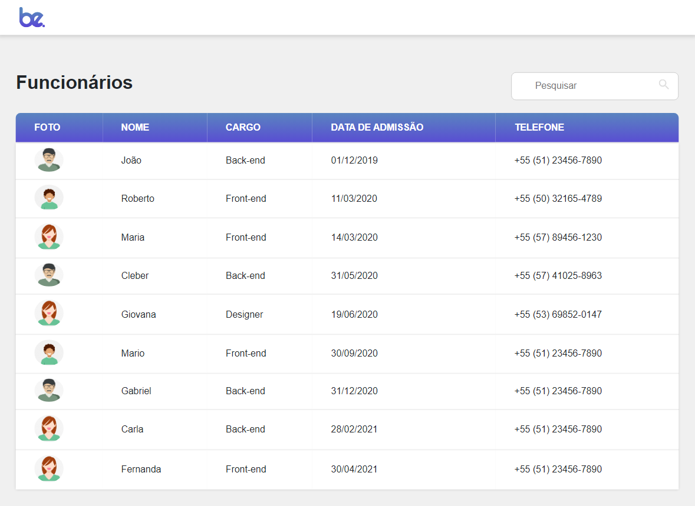
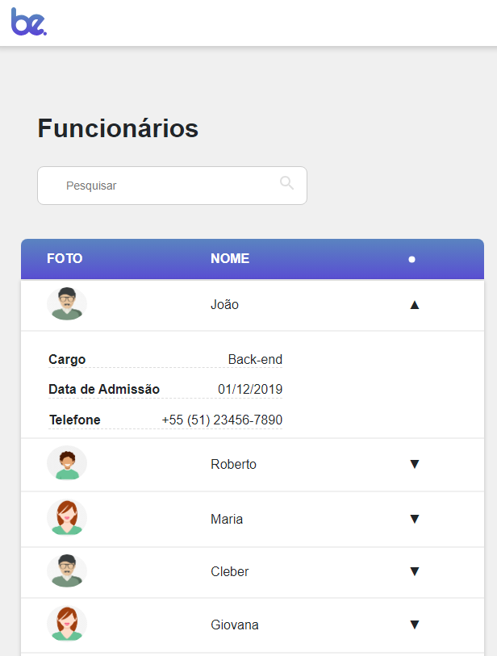

# Bemobile Project Desafio Front-End

## Sobre o Projeto

Este projeto é uma aplicação React que utiliza SASS e Axios para criar uma tabela responsiva. A tabela inclui colunas dcom os dados de Foto, Nome, Cargo, Data de Admissão e Telefone, e possui uma funcionalidade de busca que filtra as informações pelo cargo, nome e telefone.



caso a aplicação seja aberta em um mobile (telas com 755px ou menos), é criado modo de responsividade, a tabela vira um acordeon, suprimindo as informações de Cargo, Data de Admissão e telefone, mostrando apenas quando clicado pra expandir



## Pré-Requisitos

Antes de começar, você vai precisar ter instalado em sua máquina as seguintes ferramentas:

- [Git](https://git-scm.com)
- [Node.js](https://nodejs.org/en/)
- [npm](https://docs.npmjs.com/downloading-and-installing-node-js-and-npm) 

Além disso, é bom ter um editor para trabalhar com o código, como [VSCode](https://code.visualstudio.com/).

## Instruções para rodar a Aplicação

### 1. Clonando o Repositório

```bash
# Clone este repositório
$ git clone https://github.com/devpedroeduardo/bemobile-project.git

# Acesse a pasta do projeto no terminal
$ cd frontEnd-Bemobile
```

### 2. Instalando as Dependências
```bash
# Instale as depedências do projeto
$ npm install
```

### 3. Comandos para Execução do Projeto
```bash
# Execute o comando para inciar o json-server
$ npm run server

# Execute o comando para rodar o projeto
$ npm run dev
```

## Tecnologias Utilizadas


 


### observações extra
 criei uma lista de checkup com tudo que pretendia fazer, caso queira ver como fiz a quebra das atividades pode ser vista na seguinte PR: [develop](https://github.com/thiagooo14/frontEnd-Bemobile/pull/6)
